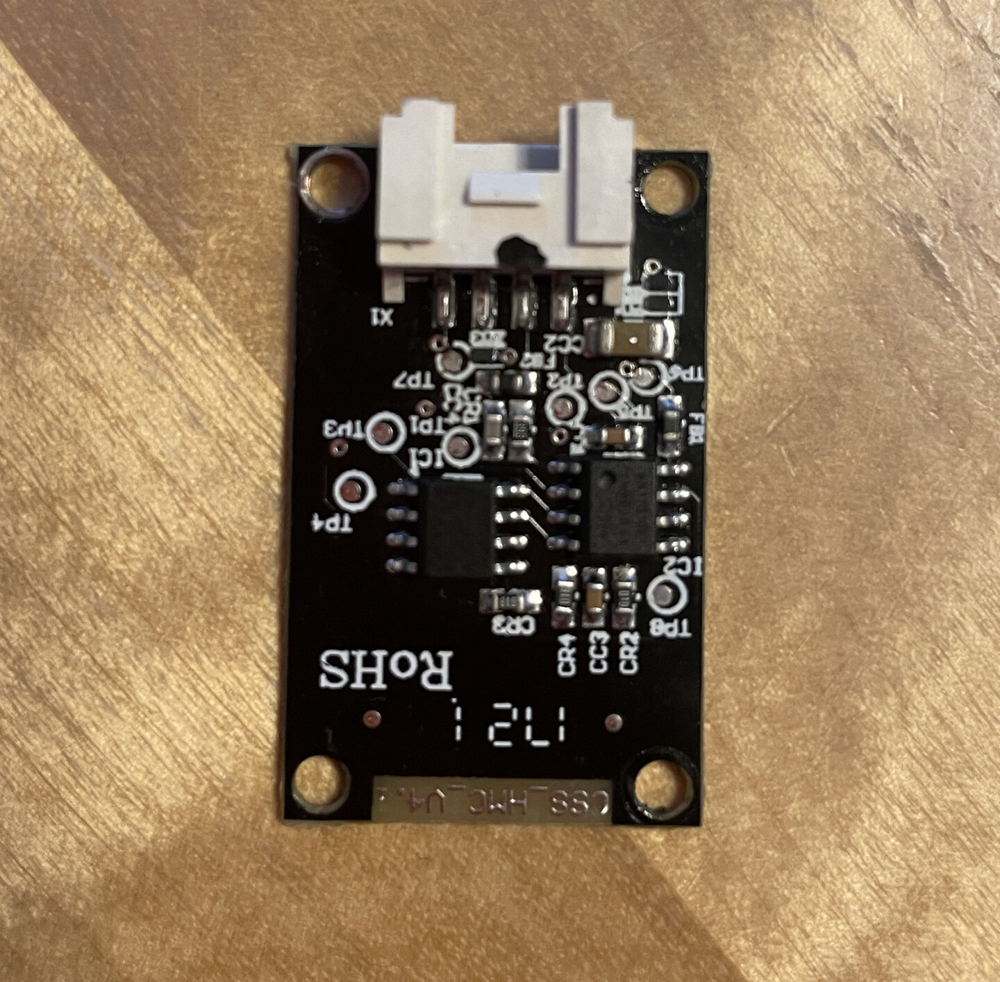
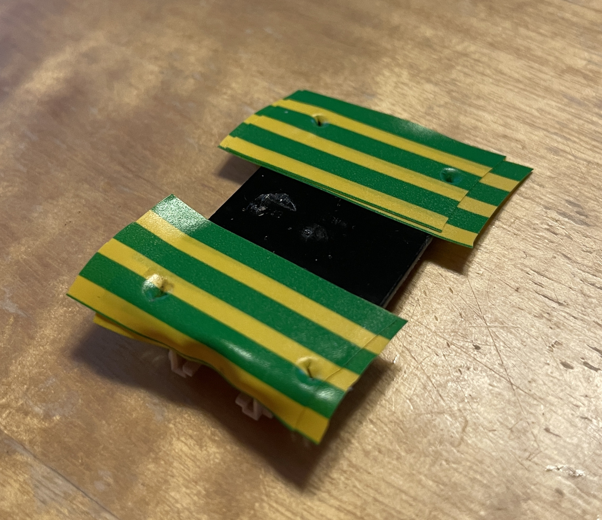
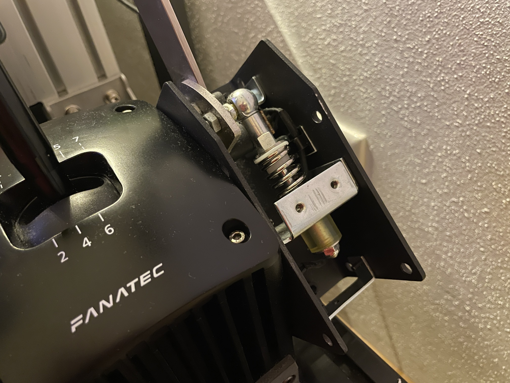
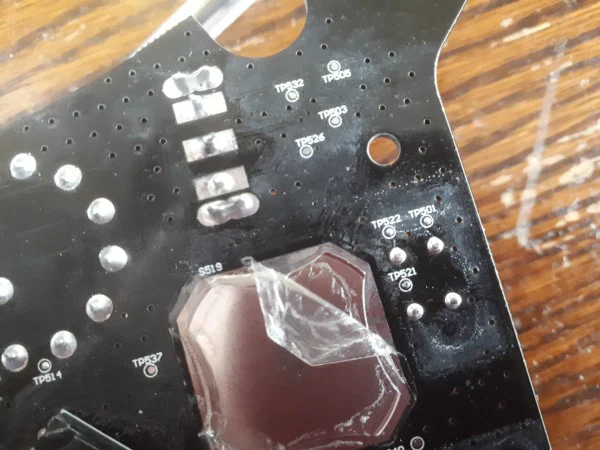
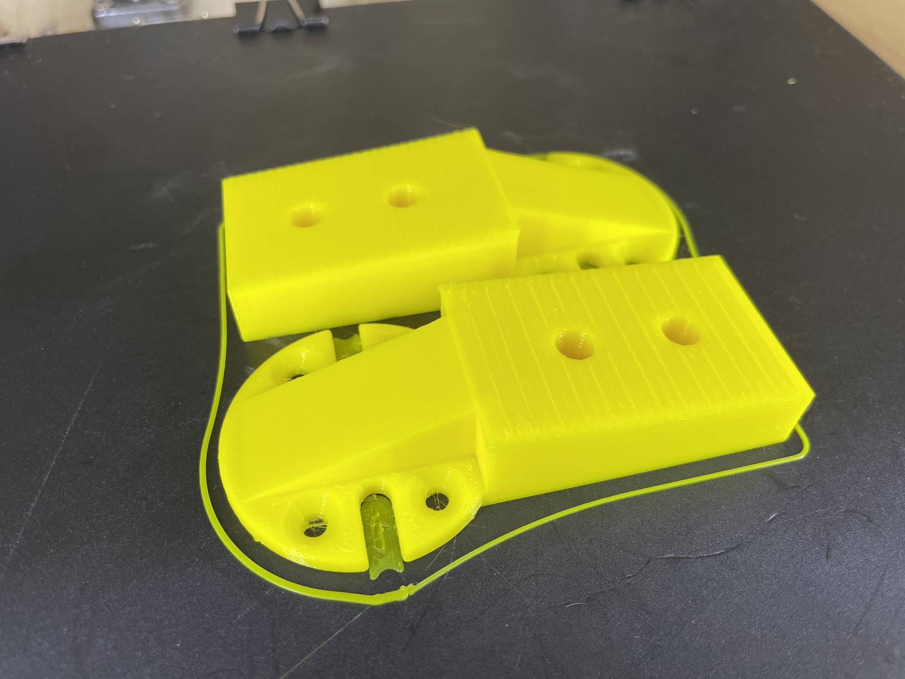
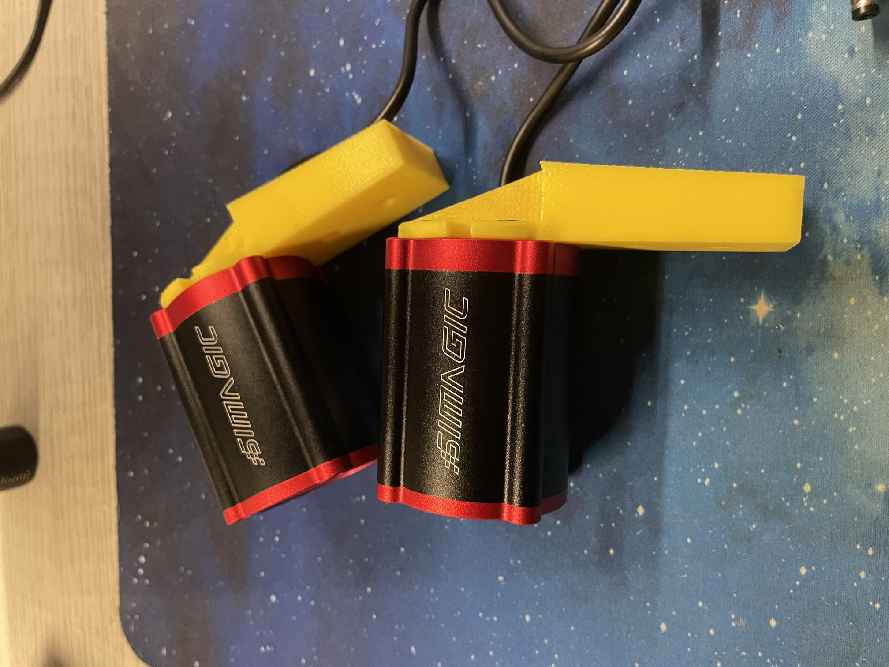
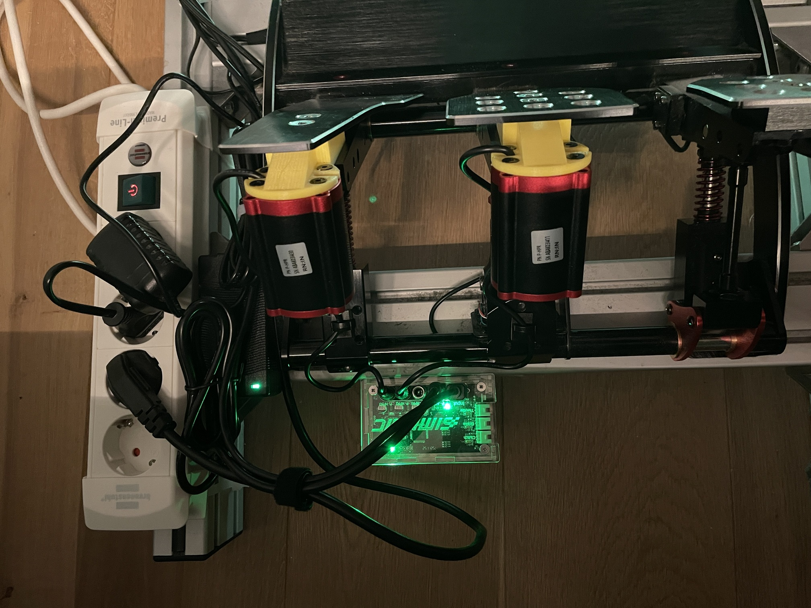
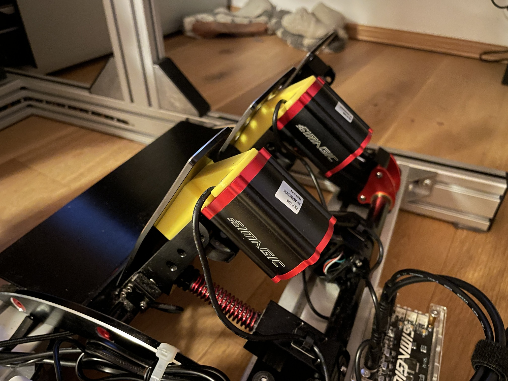

# Fanatec GT DD Pro with Clubsport Pedals v3

> ⚠️ WIP. My summary fanatec experience. Feel free to contribute if you like 🤓

These are my experiences collected over time beginning from 19.02.2022 with this **great wheel base**.

<!-- TOC -->

- [Fanatec GT DD Pro with Clubsport Pedals v3](#fanatec-gt-dd-pro-with-clubsport-pedals-v3)
  - [Gran Turismo® DD Pro Wheelbase (Bundle)](#gran-turismo-dd-pro-wheelbase-bundle)
    - [Pain points](#pain-points)
    - [Fixing loose shaft](#fixing-loose-shaft)
  - [ClubSport Shifter SQ V1.5](#clubsport-shifter-sq-v15)
    - [Mis-shifting problem](#mis-shifting-problem)
  - [ClubSport Handbrake V1.5](#clubsport-handbrake-v15)
    - [Internal screw gets loose](#internal-screw-gets-loose)
  - [CSL Elite Steering Wheel WRC](#csl-elite-steering-wheel-wrc)
    - [Gear upshift not working](#gear-upshift-not-working)
  - [CS Pedals v3](#cs-pedals-v3)
    - [CSP v3 and in game pedal force feedback?](#csp-v3-and-in-game-pedal-force-feedback)
      - [Pedal FFB game list](#pedal-ffb-game-list)
  - [Wheelbase modes](#wheelbase-modes)
  - [My thingiverse designs for Fanatec](#my-thingiverse-designs-for-fanatec)
  - [Modding](#modding)
    - [Simagic P-HPR Haptic Pedal Reactor](#simagic-p-hpr-haptic-pedal-reactor)
      - [My P-HPR modding - Fanatec ClubSport V3 Pedals block with P-HPR mountt\](https://www.thingiverse.com/thing:7397377)](#my-p-hpr-modding---fanatec-clubsport-v3-pedals-block-with-p-hpr-mountthttpswwwthingiversecomthing7397377)
      - [P-HPR YT videos](#p-hpr-yt-videos)
      - [P-HPR reactor mounts](#p-hpr-reactor-mounts)
      - [Simagic Control box](#simagic-control-box)

<!-- /TOC -->

## Gran Turismo® DD Pro Wheelbase (Bundle)

As a console player on PlayStation i started width the 5 Nm and upgraded later to 8 Nm. **It is a great Wheelbase!**

### Pain points

* As a console player, you have no way to upgrade the firmware of wheelbase or other components. PC is mandatory!
* The shaft of my model kept coming loose (I guess I got a lemon). See fix below - [Fixing loose shaft](#fixing-loose-shaft).
* The QR1 sometimes has a bit of play. For this reason, I always use the screw to prevent that. Thats the opposite of quick release ;o)
* The Gran Turismo steering wheel has a cheap rubber coating. Over time, it feels sticky and, in places, starts to
  crumble.
* Latest firmware update with Fullforce makes problems for me at the time of writing
  * Gran Turismo 7: random sudden in game menu cursor movement
  * Assetto Corsa Rally: The force feedback feels weird or scratchy.

### Fixing loose shaft

If you have the loose shaft clamp problem you have to realign the quickrelease and tighten the clamp screw with **15 Nm torque**. The best is to buy a torque wrench. Doing this with a simple allen key is in my opinion quiet hard depending to the length it has.

YT Source: https://www.youtube.com/watch?v=q73Kw6knoBQ

<video src="videos/shaft/dd-shaft-clamp-torque.m4v" width="320" height="240" controls></video>

## ClubSport Shifter SQ V1.5

This is a rock solid full metal shifter. But my one has the [mis-shifting problem](#mis-shifting-problem). It has also since developed a stripped screw thread on the top. These small screws are somewhat undersized, and you have to be extremely careful with the aluminum threaded holes.

### Mis-shifting problem

I followed different solutions i found on internet. But they do not last for long. My final solution you can see in the following photos. I placed two layers of electrical tape onto the pcb near the mounting holes. Since then i had never the mis-shifting problem again.

## ClubSport Handbrake V1.5

Looking back, I wouldn't buy this handbrake again. It has even been referred to as a cucumber slicer ;o)

### Internal screw gets loose

After some time the internal handbrake nut got loose with a loude noise. Just open it and screwing it all together.

There are other reports on the internet regarding potentiometer problems.

## CSL Elite Steering Wheel WRC

I like it very much. Really gets you in the mood for rallying.

### Gear upshift not working

Sadly i had the problem of a not working gear upshift. There is not much you can do here. Getting spare parts (this little tiny spring metal dome plates) is hard and expensive. Luckily fanatec send me a replacement WRC wheel even out of warranty!

* https://www.youtube.com/watch?v=-aBbDJWOFu8
* https://www.digikey.de/de/products/detail/snaptron/GX12900/20376485
* https://www.snaptron.com/products/standard-domes/gx-series/

<video src="videos/wheels/wrc-wheel-gearshift-not-working.m4v" width="320" height="240" controls></video>

## CS Pedals v3

At the beginning i had the CSL Pedals (and later upgraded it with a load cell break padel). But curiosity drove me to the CS Pedal v3. They are rock solid. Nothing to worry about except the force feedback of break and throttle.

### CSP v3 and in game pedal force feedback?

Hard to find resources which game supports CSP V3 force feedback. If there is FFB it is very week 😢
The following table reflects my experiences.

#### Pedal FFB game list

| Game (tested Platform)           | Wheelbase Mode | CS V3 Pedal FFB |
|:---------------------------------|:--------------:|:---------------:|
| Assetto Corsa Competitione (PC)  |       🔴       |       ✅        |
| Assetto Corsa Competitione (PS5) |       🔵       |        -        |
| Assetto Corsa Competitione (XSX) |       🟢       |        -        |
| Assetto Corsa Rally (PC)         |       🔴       |       ✅        |
| Dirt Rally 2.0 (PC)              |      🔴🟡      |        -        |
| Dirt Rally 2.0 (PS5)             |       🔵       |        -        |
| EA WRC 23 (PS5)                  |       🔵       |       ✅        |
| EA WRC 24 (PC)                   |       🔴       |       ✅        |
| Forza Motorsport 2023 (PC)       |       🔴       |        -        |
| Forza Motorsport 7 (XSX)         |       🟢       |        -        |
| Gran Turismo 7 (PS5)             |       🔵       |        -        |
| WRC Generations (XSX)            |       🟢       |        -        |

## Wheelbase modes

## My thingiverse designs for Fanatec

* [Fanatec Shifter 120x40 aluminium profile Sim Rig clamp/mount](https://www.thingiverse.com/thing:5336306)
* [Fanatec Shifter 120x40 aluminium profile Sim Rig clamp/mount V2](https://www.thingiverse.com/thing:5355550)
* [Fanatec DD Pro power supply PSU holder (mount) 8Nm 80x40 aluminium profile](https://www.thingiverse.com/thing:5337675)
* [Fanatec knob holder M12x1.5](https://www.thingiverse.com/thing:5344102)
* [Fanatec clubsport handbrake cable protection](https://www.thingiverse.com/thing:5352348)
* [Fanatec ClubSport Pedals V3 Block](https://www.thingiverse.com/thing:7395715)
* [Fanatec ClubSport V3 Pedals block with P-HPR mount](https://www.thingiverse.com/thing:7397377)

## Modding

### Simagic P-HPR Haptic Pedal Reactor

#### My P-HPR modding - Fanatec ClubSport V3 Pedals block with P-HPR mountt](https://www.thingiverse.com/thing:7397377)

My design fresh out of the printer ;o)

Mounting the shaker to the adapter block. Be careful not to damage the screw threads on the shaker. If necessary, it is better to drill out the holes for the four small screws.

Top view break and clutch.

View from the side. Here you can see the original Fanatec rumble motors at their original location.

#### P-HPR YT videos

* https://www.youtube.com/watch?v=BnpLW1NoHso
* https://www.youtube.com/watch?v=b9ShITD0E0k

#### P-HPR reactor mounts

* https://3dgo.app/models/makerworld/2058355
* https://www.etsy.com/de/listing/1629522870/simagic-p-hpr-und-p-hprgt-haptic-pedal
* https://cults3d.com/en/3d-model/tool/fanatec-clubsport-v3-soportes-para-motor-haptico-simagic-impr3dd
* https://www.printables.com/model/677198-simagic-p-hpr-mount-for-fanatec-clubsport-v3-pedal
* https://makerworld.com/de/models/2058355-simagic-p-hpr-mount-on-fanatec-clubsport-v3-pedals#profileId-2222102
* https://www.printables.com/model/679814-clubsport-pedals-v3-haptic-pedal-reactor-mount
* https://www.printables.com/model/1279181-simagic-haptic-pedal-reactor-p-hpr-bracket-for-fan/related
* https://www.printables.com/model/976496-fanatec-csl-load-cell-brake-adapter-for-the-simagi

#### Simagic Control box

* https://www.thingiverse.com/thing:6476832
* https://www.printables.com/model/1455864-simagic-pedal-board-holder-bracket-p2000-or-haptic
